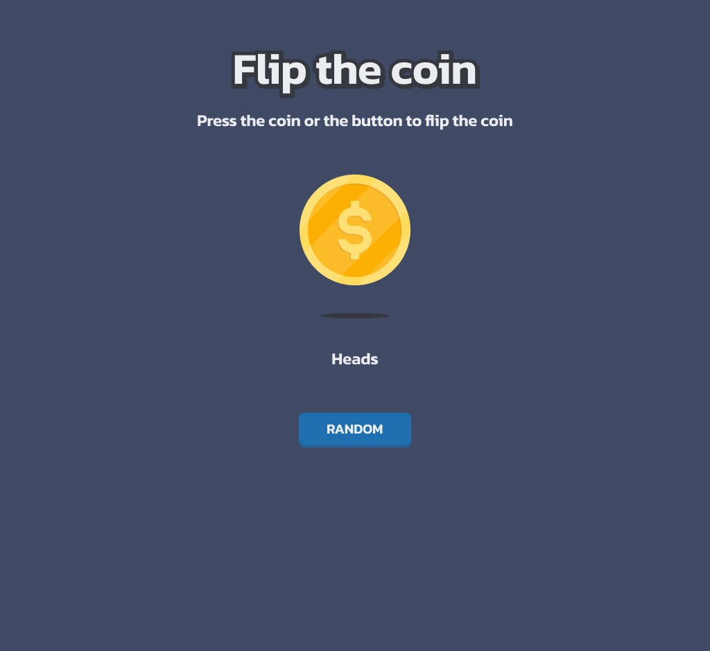
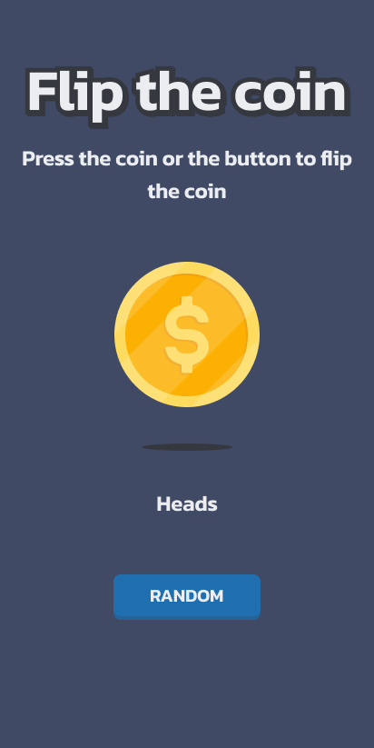

# 🪙 Coin Flip Game

A simple and fun Coin Flip Game built using **HTML**, **CSS**, and **JavaScript**. Click the coin or the "Flip Coin" button to toss a virtual coin and see if it lands on **Heads** or **Tails**. The result is shown with a smooth animation and styled badge.

## 🚀 Live Demo

👉 [**View Live Demo**](flipacoin-prj.vercel.app)  


## 🖼️ Preview

| Desktop                         | Tablet                         | Mobile                         |
|--------------------------------|--------------------------------|-------------------------------|
|  |  |  |


## ✨ Features

- Flip a virtual coin with animation 🎯
- Click the coin or button to trigger flip
- Smooth spinning animation with blur effect
- Displays "Flipping..." before result
- Beautiful result badge with dynamic styling
- Responsive layout for mobile, tablet, and desktop
- Clean UI with shadow effects


## 🛠️ Tech Stack

| Tech      | Purpose                  |
|-----------|--------------------------|
| HTML      | Structure of the app     |
| CSS       | Styling and responsiveness |
| JavaScript| Coin logic + interactivity |
| SVG       | Coin images (Heads, Tails, Shadow)


## 📁 Folder Structure
```
flip-coin/
├── assets/
│ ├── heads.svg
│ ├── tails.svg
│ ├── shadow.svg
│ └── favicon.svg
├── index.html
├── styles.css
├── script.js
└── README.md
```


## 🧑‍💻 How to Run Locally

```bash
# Clone the repository
git clone https://github.com/your-username/coin-flip-game.git

# Navigate to the project folder
cd coin-flip-game

# Open with Live Server OR just open index.html in browser
```

## 📌 License

This project is open-source and free to use under the MIT License.
